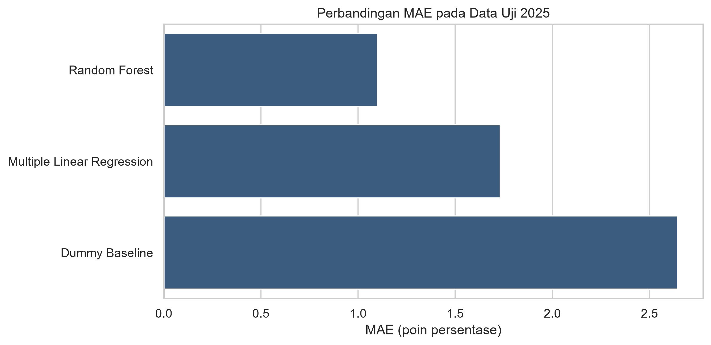
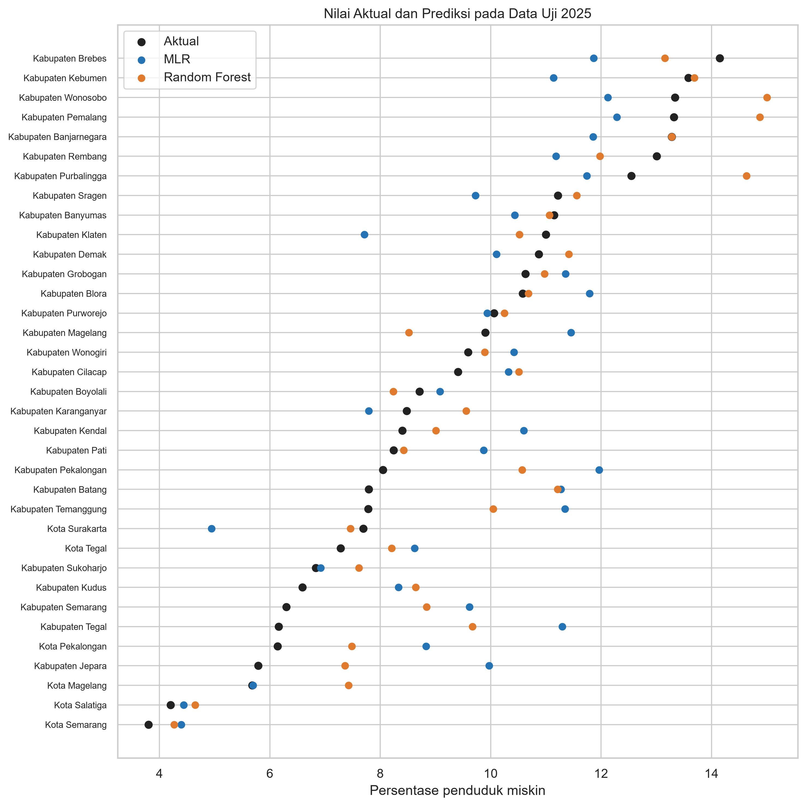

# Pemodelan Kemiskinan Jawa Tengah 2020–2025

Analisis data panel kabupaten/kota dan perbandingan Multiple Linear Regression dengan Random Forest untuk memodelkan persentase penduduk miskin di Jawa Tengah.

## Ringkasan

Penelitian menggunakan 210 observasi dari 35 kabupaten/kota selama 2020–2025. Target penelitian adalah persentase penduduk miskin, sedangkan prediktornya mencakup umur harapan hidup, harapan lama sekolah, rata-rata lama sekolah, pengeluaran per kapita disesuaikan, dan tingkat pengangguran terbuka.

Desain evaluasi mengikuti urutan waktu:

- Data latih dan EDA: 2020–2024, sebanyak 175 observasi.
- Tuning Random Forest: expanding-year validation dengan tahun validasi 2021, 2022, 2023, dan 2024.
- Data uji akhir yang dikunci: 2025, sebanyak 35 observasi.

Pemisahan temporal mencegah informasi tahun 2025 memengaruhi EDA, tuning, atau pemilihan model.

## Hasil utama

| Model | MAE | CI 95% MAE | RMSE | R² |
|---|---:|---:|---:|---:|
| **Random Forest** | **1,099** | **0,802–1,419** | **1,442** | **0,731** |
| Multiple Linear Regression | 1,731 | 1,316–2,182 | 2,158 | 0,398 |
| Dummy Baseline | 2,644 | 2,043–3,259 | 3,167 | -0,297 |

Random Forest menghasilkan MAE 0,634 poin persentase lebih rendah daripada MLR. Bootstrap berpasangan memberikan CI 95% sebesar 0,267–0,965 untuk selisih tersebut, sehingga keunggulan MAE Random Forest konsisten pada resampling 35 wilayah uji.

## Interpretasi yang bertanggung jawab

- Random Forest memiliki performa prediktif terbaik pada holdout 2025.
- Diagnostik MLR menunjukkan penyimpangan normalitas residual (Shapiro–Wilk p = 0,031) dan heteroskedastisitas (Breusch–Pagan p = 0,009).
- Inferensi koefisien MLR karena itu dilaporkan menggunakan standard error cluster-robust menurut kabupaten/kota.
- HLS dan RLS memiliki VIF di atas 5; keduanya dipertahankan sesuai kerangka konseptual dan diuji kembali melalui analisis sensitivitas.
- Seluruh hasil adalah hubungan prediktif/asosiatif, bukan bukti hubungan sebab-akibat.

## Variabel penelitian

| Peran | Variabel | Satuan |
|---|---|---|
| Target | Persentase penduduk miskin | Persen |
| Prediktor | Umur harapan hidup (UHH) | Tahun |
| Prediktor | Harapan lama sekolah (HLS) | Tahun |
| Prediktor | Rata-rata lama sekolah (RLS) | Tahun |
| Prediktor | Pengeluaran per kapita disesuaikan | Ribu rupiah/orang/tahun |
| Prediktor | Tingkat pengangguran terbuka (TPT) | Persen |

Garis kemiskinan dan jumlah penduduk miskin tidak dipakai sebagai prediktor karena terlalu dekat secara definisi dengan target.

## Tahapan penelitian

1. Membaca enam ZIP sumber BPS tanpa mengubah data mentah.
2. Menstandarkan kode dan nama 35 kabupaten/kota menggunakan crosswalk wilayah BPS.
3. Menghapus agregat Provinsi Jawa Tengah (`3300`).
4. Menggabungkan enam indikator berdasarkan `kode_wilayah` dan `tahun` dengan validasi relasi satu-ke-satu.
5. Mengaudit cakupan tahun, missing value, duplikasi, jumlah wilayah, dan checksum SHA-256 sumber.
6. Melakukan EDA, analisis tren, korelasi, dan VIF hanya pada data latih.
7. Membandingkan Dummy Baseline, MLR, dan Random Forest pada holdout 2025.
8. Menghitung CI bootstrap MAE, permutation importance, diagnostik MLR, dan analisis sensitivitas.

Notebook otomatis membaca `data/raw/`, menulis dataset gabungan ke `data/processed/`, menyimpan tabel evaluasi ke `reports/`, dan mengekspor figur 300 dpi ke `reports/figures/`.

## Dokumentasi
- [Evaluasi dan catatan metodologis](reports/model_evaluation.md)
- [Indeks seluruh artefak](reports/README.md)

## Keterbatasan

- Dataset hanya mencakup enam tahun dan satu provinsi.
- Holdout akhir terdiri dari 35 wilayah pada satu tahun, sehingga generalisasi ke tahun atau provinsi lain perlu diuji kembali.
- Observasi merupakan data panel; cluster-robust standard error membantu inferensi MLR, tetapi tidak mengubah penelitian ini menjadi desain kausal.
- Perubahan definisi atau revisi seri BPS dapat mengubah hasil ketika data diperbarui.

## Lisensi

Kode dan dokumentasi menggunakan [MIT License](LICENSE). Hak atas data mentah mengikuti ketentuan BPS sebagai penerbit sumber.

## Penulis

[SYFDNNN](https://github.com/SYFDNNN)
